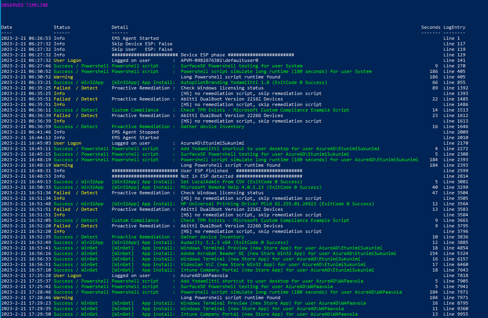
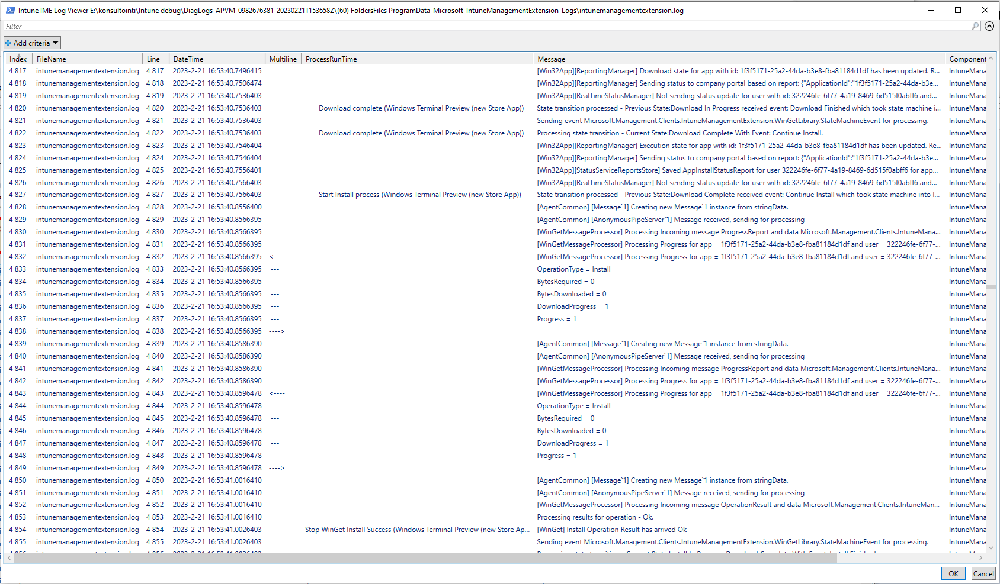

# Get-IntuneManagementExtensionDiagnostics #
Go to script [Get-IntuneManagementExtensionDiagnostics.ps1](./Get-IntuneManagementExtensionDiagnostics.ps1)



This script **analyzes** Microsoft Intune Management Extension (IME) log(s) and creates timeline report from found actions.

Timeline report includes information about Intune events
*  **Win32App**
*  **WinGetApp**
*  **Powershell scripts**
*  **Proactive Remedation scripts**
*  **custom Compliance Policy scripts**

Windows Autopilot ESP phases and other information is also shown on timeline.

### Usage: ###
**Download** script from PowershellGallery with command:  
```
Save-Script Get-IntuneManagementExtensionDiagnostics -Path ./
```
**Run script**  
```
./Get-IntuneManagementExtensionDiagnostics.ps1

# or to get Intune Powershell script names from Graph API
# use -Online parameter
./Get-IntuneManagementExtensionDiagnostics.ps1 -Online
```
**-Online** parameter will download Powershell script names from Graph API. Win32App and WinGetApp names are detected from Intune log files.  
-Online parameter requires Intune Powershell management module **Microsoft.Graph.Intune** installation.

You can install Intune Powershell management module to your user account with command
```
Install-Module -Name Microsoft.Graph.Intune -Scope CurrentUser
```

Intune Powershell scripts' outputs and errors can be also shown in Timeline view with parameters  
**-ShowStdOutInTimeline**  
**-ShowErrorsInTimeline**  
This shows instantly what is problem with failed Powershell scripts

There are many more Parameters but these should get you started.


**In Autopilot Shift-F10 Command Prompt during Autopilot Pre-Provisioning or Enrollment Status Page**  
```
Powershell.exe
cd C:\ProgramData
Set-ExecutionPolicy bypass -Scope Process
Save-Script Get-IntuneManagementExtensionDiagnostics -Path ./
./Get-IntuneManagementExtensionDiagnostics.ps1

# -Online when you need to get displayNames to Powershell scripts
./Get-IntuneManagementExtensionDiagnostics.ps1 -Online
```
### LogViewerUI - better than cmtrace.exe ?-) ###



Script also includes really capable Log Viewer UI when script is started with parameter **-ShowLogViewerUI**
```
./Get-IntuneManagementExtensionDiagnostics.ps1 -Online -ShowLogViewerUI
```
LogViewerUI (Out-GridView) looks a lot like cmtrace.exe tool but it is better because all found Timeline events are added to log for easier debugging.
   
LogViewerUI has good search and filtering capabilities. Try to filter known log entries in Timeline:  
**Add criteria -> ProcessRunTime -> is not empty**
   
Selecting last line (RELOAD) and OK will reload log file.
   
Script can merge multiple log files so especially in LogViewerUI you can see Powershell command outputs from AgentExecutor.log

### Backlog: ###
There are many features in development and planned in future. Stay tuned :)
