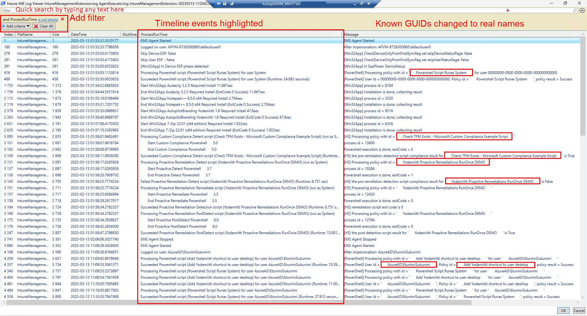
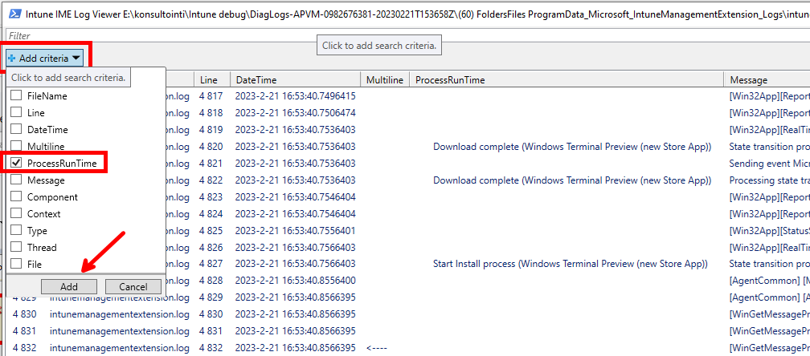
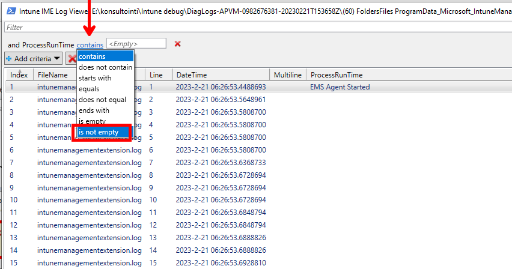
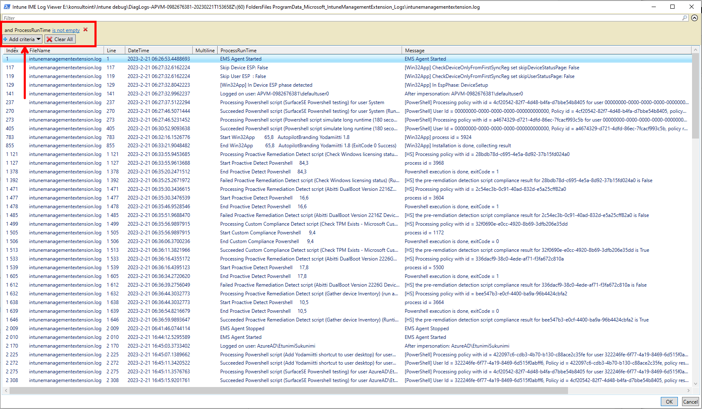
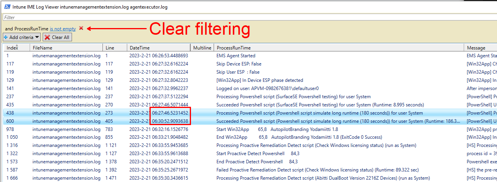
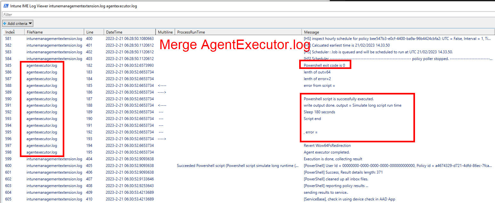
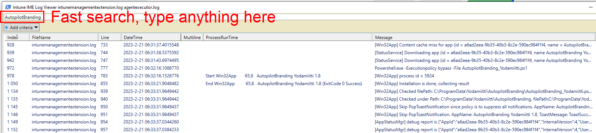

# Get-IntuneManagementExtensionDiagnostics v2.3 (2024-05-10) #
**2024-05-10 update**  
New version 2.3 uses **Microsoft.Graph.Authentication** module.

New version 2.0 creates HTML report which has more information and for example has additional info in HoverOn ToolTips.**

This script **analyzes** Microsoft Intune Management Extension (IME) log(s) and creates timeline report from found events.

For Win32App delivery it also shows summary of download statistics with estimated network bandwidth and **Delivery Optimization** statistics.

It also includes really capable **-LogViewerUI** for Intune log(s) viewing and troubleshooting.

Go to script [Get-IntuneManagementExtensionDiagnostics.ps1](./Get-IntuneManagementExtensionDiagnostics.ps1)

[](https://github.com/petripaavola/Get-IntuneManagementExtensionDiagnostics/blob/main/pics/Get-IntuneManagementExtensionDiagnostics_v2.0_FullReport.jpg?raw=true)


Timeline report includes information about Intune events
*  **Win32App**
*  **WinGetApp**
*  **Powershell scripts**
*  **Proactive Remedation scripts**
*  **custom Compliance Policy scripts**

Windows Autopilot ESP phases and other information is also shown on timeline.

### Usage: ###
**Download** script from PowershellGallery with command:  
```
Save-Script Get-IntuneManagementExtensionDiagnostics -Path ./
```
**Run script**  
```
./Get-IntuneManagementExtensionDiagnostics.ps1

# or to get Intune Powershell script names from Graph API use -Online parameter
./Get-IntuneManagementExtensionDiagnostics.ps1 -Online
```
**-Online** parameter will download Powershell script names from Graph API. Win32App and WinGetApp names are detected from Intune log files.  
-Online parameter requires Microsoft Graph module **Microsoft.Graph.Authentication** installation.

You can install **Microsoft.Graph.Authentication** module to your user account with command
```
Install-Module -Name Microsoft.Graph.Authentication -Scope CurrentUser
```

**In Windows Autopilot Shift-F10 Command Prompt during Windows Autopilot Pre-Provisioning or Enrollment Status Page**  
```
Powershell.exe
cd C:\ProgramData
Set-ExecutionPolicy bypass -Scope Process
Save-Script Get-IntuneManagementExtensionDiagnostics -Path ./
./Get-IntuneManagementExtensionDiagnostics.ps1

# -Online when you need to get displayNames to Powershell scripts
./Get-IntuneManagementExtensionDiagnostics.ps1 -Online
```

### Parameters ###

**-AllLogEntries** **-AllLogFiles**  
Open all supported log files (IntuneManagementExtension and AgentExecutor) automatically and also show all log events  
**These options prevents showing UIs which asks same information**
```
.\Get-IntuneManagementExtensionDiagnostics.ps1 -Online -AllLogEntries -AllLogFiles
```
**-LogFile**  
Open log file specifying fullpath to logfile
```
./Get-IntuneManagementExtensionDiagnostics.ps1 -LOGFile "C:\temp\MDMDiagReport\IntuneManagementExtension.log"
```
**-LogFilesFolder**  
Open log files folder and show UI where you can select what Intune log files to open.

You can copy Intune client logs from **C:\ProgramData\Microsoft\IntuneManagementExtension\Logs** folder and analyze logs in another device.  
Or you can download Intune logs from remote computer with Intune action **Collect Diagnostics** and analyze in another device.
```
./Get-IntuneManagementExtensionDiagnostics.ps1 -LogFilesFolder "C:\temp\MDMDiagReport"
```
**-ZipFile**  
Extract the zip file and open the log file inside
```
./Get-IntuneManagementExtensionDiagnostics.ps1 -ZipFile "C:\temp\MDMDiagReport\D-00000.zip"
```

**-CabFile**  
Extract the CAB file and open the log file inside
```
./Get-IntuneManagementExtensionDiagnostics.ps1 -CabFile "C:\temp\MDMDiagReport\mdmlogs-00000.cab"
```

**-ShowAllTimelineEntries**  
Shows start events on Timeline.
```
./Get-IntuneManagementExtensionDiagnostics.ps1 -ShowAllTimelineEntries
```


Intune Powershell scripts' outputs and errors can be also shown in Timeline view with parameters  
**-ShowStdOutInTimeline**  
**-ShowErrorsInTimeline**  
**-ShowErrorsSummary**  
This shows instantly what is problem with failed Powershell scripts

There are many more Parameters but these should get you started.


### LogViewerUI - better than cmtrace.exe ?-) ###


Script also includes really capable Log Viewer UI when script is started with parameter **-ShowLogViewerUI**
```
./Get-IntuneManagementExtensionDiagnostics.ps1 -Online -ShowLogViewerUI -ConvertAllKnownGuidsToClearText
```
LogViewerUI (Out-GridView) looks a lot like cmtrace.exe tool but it is better because all found Timeline events are added to log for easier debugging.

Parameter **-ConvertAllKnownGuidsToClearText** replaces all known GUIDs to real App and script names. This makes viewing log 1000% easier.

LogViewerUI has good search and filtering capabilities. Try to filter known log entries in Timeline:  
**Add criteria -> ProcessRunTime -> is not empty**
   
Selecting last line (RELOAD) and OK will reload log file.
   
Script can merge multiple log files so especially in LogViewerUI you can see Powershell command outputs from AgentExecutor.log

Check [screenshots](https://github.com/petripaavola/Get-IntuneManagementExtensionDiagnostics/tree/main/pics)  
  


### Backlog: ###
There are many features in development and planned in future. Stay tuned :)

### Known issues: ###
*  WinGetApp install may be detected falsepositive wrong. There is WinGet App install fail and empty App name and UserName in Timeline view.
   *  Status: Fixed in version 1.1
*  Win32App Uninstall is shown as Install at least in Supercedende case
   *  Verified that intent is not gathered right in Win32App and WinGetApp install/uninstall
   *  Status: Fixed in version 1.1

